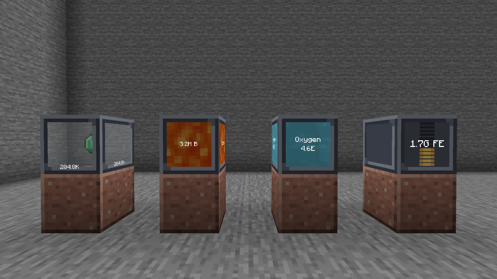

# Acervus

English | [日本語](README.ja.md)

Storage blocks that each hold one kind of thing, in amounts far beyond a chest.

## Blocks

| Block | |
|---|---|
| Item Heap | Holds one kind of item. 2,000,000,000 by default |
| Fluid Heap | Holds one fluid. 1,000,000,000 buckets by default |
| Energy Heap | Holds Forge Energy (FE). 1,000,000,000,000 FE by default |
| Gas Heap | Holds one Mekanism chemical. 1,000,000,000,000 mB by default |
| Horreum | A rack that holds nine heaps of any kind and lets pipes reach all of them |

A heap keeps its contents when it is broken. Carried in the inventory, an Item Heap
picks up the item it holds.

## Documents

| | |
|---|---|
| [Heaps and the Horreum](docs/heaps.md) | What each block does and how to use it |
| [Config](docs/config.md) | Every setting |
| [Design notes](docs/design.md) | Notes on the source, file by file |

## Screenshots



More in [branding/gallery](branding/gallery).

## Requirements

| | |
|---|---|
| Minecraft | 1.21.1 |
| NeoForge | 21.1.248 |
| Java | 21 |

Optional: [Mekanism](https://www.curseforge.com/minecraft/mc-mods/mekanism) for the Gas
Heap, [Refined Storage](https://www.curseforge.com/minecraft/mc-mods/refined-storage) to
read heaps past 2,147,483,647, [Jade](https://www.curseforge.com/minecraft/mc-mods/jade) or
[The One Probe](https://www.curseforge.com/minecraft/mc-mods/the-one-probe) to see what a
heap holds by looking at it.

## Building

```
run.bat                   # compile and launch a dev client
gradlew build             # produce the jar
gradlew runGameTestServer # run the game tests
gradlew runData           # regenerate models, recipes and language files
```

`JAVA_HOME` must point at a JDK 21, or `java` must be on `PATH`.

## License

MIT. See [LICENSE](LICENSE).
